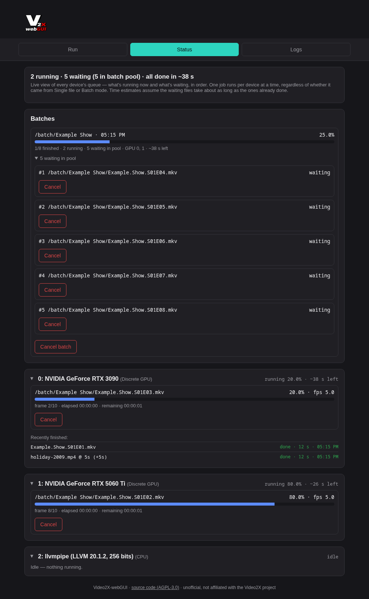
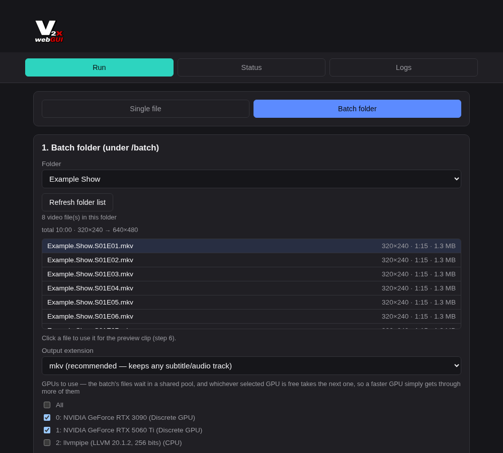
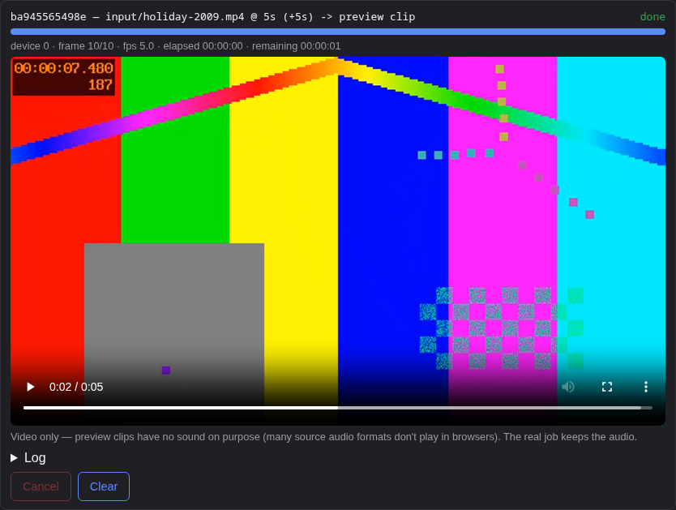

# video2x-webGUI

A web interface for [Video2X](https://github.com/k4yt3x/video2x) — AI upscaling
(Real-ESRGAN, Real-CUGAN, Anime4K/libplacebo) and frame interpolation (RIFE) of
videos on your GPUs — packaged as a `linuxserver.io`-style Docker container, so it
drops into Unraid or any other Docker host.

Video2X's desktop GUI only exists for Windows; on Linux there's just the command
line. This project puts a browser UI on top of the CLI, queues work across several
GPUs, and runs whole folders unattended.

*Unofficial — not affiliated with, endorsed by, or supported by K4YT3X or the Video2X project.*



## Features

- **Every Video2X option in the browser** — processor, model, scale, noise level,
  encoder settings. Only model/scale/noise combinations that actually work are
  offered.
- **Batch folders** — point it at a folder and every video in it gets processed.
  Outputs go into a matching folder (`/batch/Show/x.mkv` → `/videos/output/Show/x.mkv`),
  finished inputs are moved to `done/`, so an interrupted batch simply continues
  where it stopped.
- **Multiple GPUs** — each GPU runs one job at a time. Batch files wait in a shared
  pool and whichever GPU is free takes the next one, so a faster card simply does
  more of them. Single jobs you start meanwhile run next on their GPU.
- **Preview clips** — render a few seconds with the current settings and watch them
  right in the browser before committing hours to a whole season.
- **Status page** — live progress per GPU and per batch, time estimates, cancel
  anything, running/waiting counts in the tab title and browser notifications when a job or batch
  is done.
- **Video info** — resolution, frame rate, duration and the resulting output size,
  for single files and whole folders.
- **Logs** — one log file per job (with the exact command used), readable and
  deletable in the UI.

| Batch mode | Preview clip |
|---|---|
|  |  |

## Requirements

- An **x86-64 (amd64)** Docker host.
- A **Vulkan-capable GPU**:
  - **NVIDIA** (best tested): current driver and the
    [NVIDIA Container Toolkit](https://docs.nvidia.com/datacenter/cloud-native/container-toolkit/latest/install-guide.html)
    on the host; the container gets the GPUs via `--gpus all`.
  - **Intel / AMD** (untested): pass `/dev/dri` into the container; the image includes
    Mesa's Vulkan drivers. Integrated GPUs, if they work, are far slower than a
    dedicated card.
  - Without any GPU, Mesa's software renderer (`llvmpipe`) still works — fine for
    trying the UI, far too slow for real work.

### Tested on

- NVIDIA GeForce **RTX 3090** and **RTX 5060 Ti**, on Unraid with the Nvidia-Driver plugin
- Mesa's software renderer (`llvmpipe`), for the automated build test

Other GPUs should work wherever Video2X itself works, but I can't test them. GPU-specific
problems are almost always Video2X or driver issues — please report those to the
[Video2X project](https://github.com/k4yt3x/video2x/issues).

## Quick start

### Docker Compose

```yaml
services:
  video2x-webgui:
    image: ghcr.io/sognix/video2x-webgui:latest
    container_name: video2x-webgui
    environment:
      - PUID=1000
      - PGID=1000
    volumes:
      - ./config:/config
      - ./videos:/videos
      - ./batch:/batch
      - ./logs:/logs
    ports:
      - 3000:3000
    deploy:
      resources:
        reservations:
          devices:
            - driver: nvidia
              count: all
              capabilities: [gpu]
    restart: unless-stopped
```

The same file is in [`docker-compose.yml`](docker-compose.yml). For Intel/AMD, replace
the `deploy:` block with `devices: ["/dev/dri:/dev/dri"]`.

### docker run

```bash
docker run -d \
  --name video2x-webgui \
  --gpus all \
  -p 3000:3000 \
  -e PUID=1000 -e PGID=1000 \
  -v /path/to/config:/config \
  -v /path/to/videos:/videos \
  -v /path/to/batch:/batch \
  -v /path/to/logs:/logs \
  ghcr.io/sognix/video2x-webgui:latest
```

Then open `http://<host>:3000`.

## Usage

- **Single file:** upload a video (lands in `/videos/input`) or copy it there, pick
  processor and GPU, start. The result goes to `/videos/output`.
- **Batch:** put a folder of videos under `/batch`, switch to *Batch folder*, pick the
  folder and the GPUs to use, start. Non-video files in the folder are ignored.
- **Try settings first:** open *6. Preview clip*, render a few seconds and compare.
- **Watch progress** on the *Status* tab, read or clean up job logs on the *Logs* tab.

## Configuration

| Volume | Purpose |
|---|---|
| `/config` | Persistent settings (e.g. the self-signed HTTPS certificate) |
| `/videos` | `input/` for single files, `output/` for all results |
| `/batch` | Folders to process in batch mode (finished inputs are moved to `<folder>/done/`) |
| `/logs` | One log file per job |

| Port | Purpose |
|---|---|
| `3000` | HTTP |
| `3001` | HTTPS with a self-signed certificate |

| Variable | Default | Purpose |
|---|---|---|
| `PUID` / `PGID` | `911` | User/group the app runs as — set them to the owner of your media folders (Unraid: `99` / `100`) |
| `UMASK` | `022` | Permissions of created files/folders. `022`: only the container user may modify them. On Unraid use `000`, otherwise SMB users can't move or delete the results |
| `CUSTOM_PORT` / `CUSTOM_HTTPS_PORT` | `3000` / `3001` | Change the listening ports |
| `SOURCE_URL` | this repository | Link to the source code in the page footer — point it at your fork if you run a modified version for others (AGPL-3.0) |

Browser notifications need a secure page: `https://` with a certificate the browser
trusts (easiest via a reverse proxy) or `localhost`. The job counts in the tab title work
everywhere.

## Security

**The web UI has no login.** Anyone who can reach the port can upload files, start and
cancel jobs and delete logs. Run it only on a trusted network, or put it behind a
reverse proxy with authentication (e.g. Authelia, Authentik, or basic auth in
nginx/Traefik/Caddy). Don't expose it to the internet as-is.

To report a vulnerability, see [`SECURITY.md`](SECURITY.md).

## Known limitations

- **amd64 only** — Video2X only ships an x86-64 Linux build.
- **Hardware decoding (`hwaccel`) is unreliable** in Video2X itself
  ([upstream issue](https://github.com/k4yt3x/video2x/issues/1202)), so it's off by
  default. It rarely matters: the upscaling runs on the GPU either way.
- **NVENC encoding** (`h264_nvenc` / `hevc_nvenc`) currently fails with a `pts < dts`
  muxing error in Video2X; use a CPU encoder such as `libx264` / `libx265`.
- Only the models bundled with Video2X are available. Supported combinations:
  - **RIFE**: `rife-v4.6`, `rife-v4.25`, `rife-v4.25-lite`, `rife-v4.26`
  - **Real-ESRGAN**: `realesr-animevideov3` (2x/3x/4x); `realesrgan-plus-anime` and `realesrgan-plus` (4x only)
  - **Real-CUGAN**: `models-nose` (2x, noise 0); `models-pro` (2x/3x, noise 0 or 3);
    `models-se` (2x any noise, 3x/4x noise 0 or 3)
  - **libplacebo**: all 7 bundled shaders, any resolution
- The job list lives in memory: a container restart forgets queued jobs (finished
  files, logs and the `done/` folders stay).

## Documentation

- [`docs/architecture.md`](docs/architecture.md) — how the image, queueing, preview clips and logs work
- [`docs/api.md`](docs/api.md) — the HTTP API behind the UI
- [`CONTRIBUTING.md`](CONTRIBUTING.md) — building and running it yourself
- [`CHANGELOG.md`](CHANGELOG.md) — what changed in each release

## Support

This is a hobby project, maintained in spare time. Bug reports with the details the
issue template asks for are very welcome and get looked at; feature requests too, but
without any promise. For problems with Video2X itself (models, output quality,
crashes of the `video2x` binary), please check the
[Video2X repository](https://github.com/k4yt3x/video2x) first.

## License

Copyright (C) 2026 sognix — AGPL-3.0-or-later, see [`LICENSE`](LICENSE).

The image bundles [Video2X](https://github.com/k4yt3x/video2x) (AGPL-3.0), FFmpeg from
Ubuntu (GPL-2.0-or-later) and the linuxserver.io base image; see [`NOTICE.md`](NOTICE.md)
for all third-party components and their licenses.
